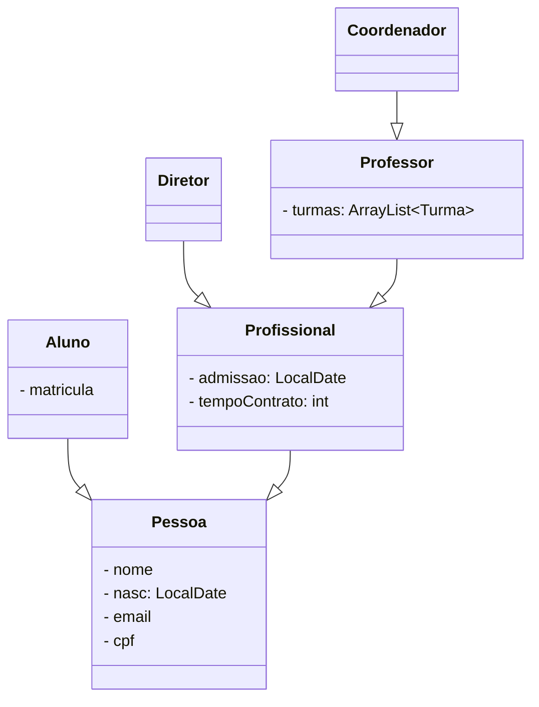
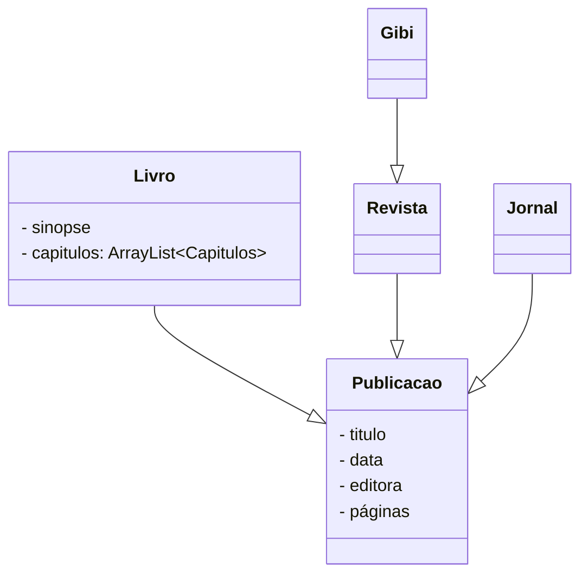

# Modelagem UML de heranças

## Sistema acadêmico

```mermaid

classDiagram
    
    direction TD
    class Pessoa {
        - nome
        - nasc: LocalDate
        - email
        - cpf
    }
    
    class Profissional {
        - admissao: LocalDate
        - tempoContrato: int
    }
    
    class Aluno {
        - matricula
    }
    
    class Professor {
        - turmas: ArrayList~Turma~
    }
    class Coordenador
    class Diretor {
        
    }
    
    Diretor --|> Profissional
    Coordenador --|> Professor
    Professor --|> Profissional
    Aluno --|> Pessoa
    Profissional --|> Pessoa

```

## Livros

```mermaid

classDiagram 
    
    class Publicacao {
        - titulo
        - data
        - editora
        - páginas
    }
    
    class Livro {
        - sinopse
        - capitulos: ArrayList~Capitulos~
    }
    
    class Gibi {
        
    }
    
    class Jornal {
        
    }
    
    class Revista {
        
    }
    
    Livro --|> Publicacao
    Gibi --|> Revista
    Revista --|> Publicacao
    Jornal --|> Publicacao
    
 
```