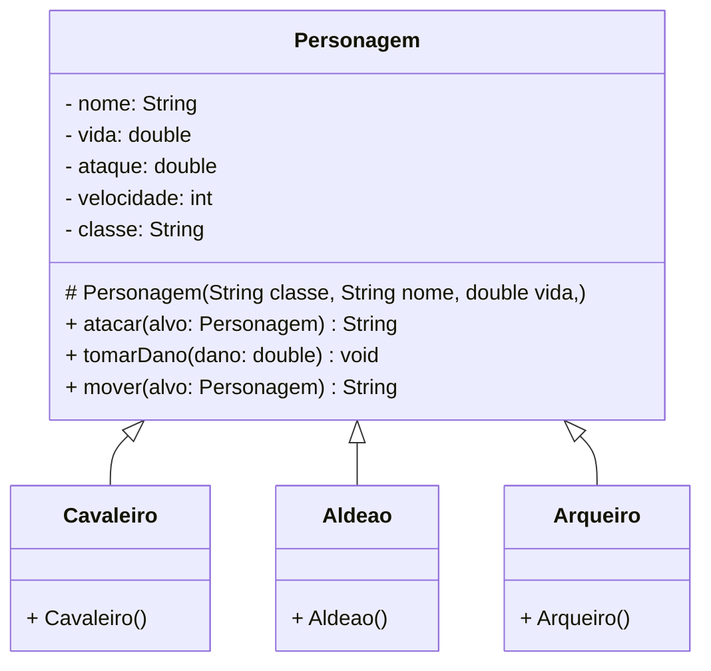

```mermaid

classDiagram
    
    direction BT
    
    class Personagem {
        - nome: String
        - vida: double
        - ataque: double
        - velocidade: int
        - classe: String
        # Personagem(String classe, String nome, double vida, )
        + atacar(alvo: Personagem) String
        + tomarDano(dano: double) void
        + mover(alvo: Personagem) String
    }
    
    class Arqueiro {
        + Arqueiro()
        
    }
    
    class Aldeao {
        + Aldeao()
    }
    
    class Cavaleiro {
        + Cavaleiro()
    }
    
    Cavaleiro --|> Personagem
    Aldeao --|> Personagem
    Arqueiro --|> Personagem
    

```