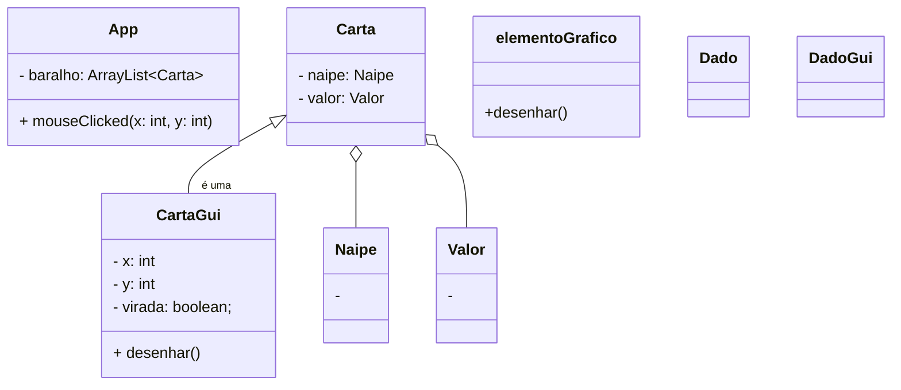

```mermaid
classDiagram
    
    class App {
        - baralho: ArrayList~Carta~
        + mouseClicked(x: int, y: int)
    }
    
    class Carta {
        - naipe: Naipe
        - valor: Valor
    }
    
    class Naipe {
        - 
    }
    
    class Valor {
        -
    }
    
    class CartaGui {
        - x: int
        - y: int
        - virada: boolean;
        + desenhar()
    }
    
    class elementoGrafico {
        
        +desenhar()
    }
    
    class Dado {
        
    }
    
    class DadoGui {
        
    }
    
    
    
    Carta <|-- "é uma" CartaGui
    Carta o-- Naipe
    Carta o-- Valor
    
    

```