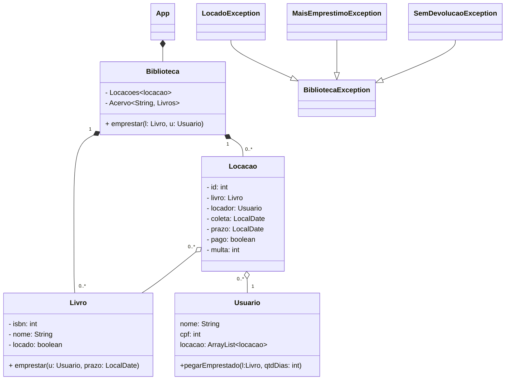

```mermaid

classDiagram
    
    
    class App {
        
    }
    
    class Biblioteca {
        - Locacoes~locacao~
        - Acervo~String, Livros~
        
        + emprestar(l: Livro, u: Usuario)
    }
    
    class Livro {
        - isbn: int
        - nome: String
        - locado: boolean
        + emprestar(u: Usuario, prazo: LocalDate)    
    }
    
    class Usuario {
        nome: String
        cpf: int
        locacao: ArrayList~locacao~
        +pegarEmprestado(l:Livro, qtdDias: int)
    }
    
    class Locacao {
        - id: int
        - livro: Livro
        - locador: Usuario
        - coleta: LocalDate
        - prazo: LocalDate
        - pago: boolean
        - multa: int
    }
    
    
    class BibliotecaException {
        
    }
    
    class LocadoException {
    }
    
    class SemDevolucaoException {
        
    }

    class MaisEmprestimoException {
        
    }
   
   App *-- Biblioteca
   Biblioteca "1" *-- "0..*" Livro
   Biblioteca "1" *-- "0..*" Locacao
   Locacao "0..*" o-- "1" Usuario
   Locacao "0..*" o-- "1" Livro
   
   LocadoException --|> BibliotecaException
   MaisEmprestimoException --|> BibliotecaException
   SemDevolucaoException --|> BibliotecaException
   
   
    
    
    
    
    

```